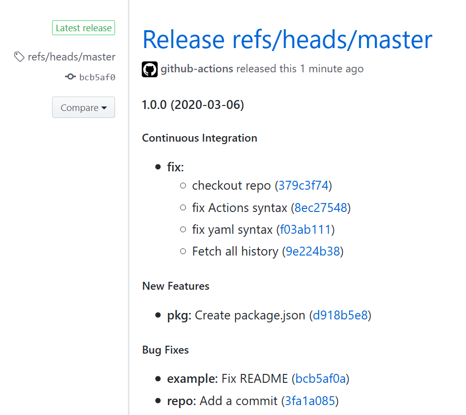

# generate-changelog-action

GitHub Action for [lob/generate-changelog](https://github.com/lob/generate-changelog/). Intended to be used with [actions/create-release](https://github.com/actions/create-release) as follows:

### Example workflow - create a release
Extends [actions/create-release: Example workflow - create a release](https://github.com/actions/create-release#example-workflow---create-a-release) to generate changelog from git commits and use it as the body for the GitHub release.

```yaml
on:
  push:
    # Sequence of patterns matched against refs/tags
    tags:
      - 'v*' # Push events to matching v*, i.e. v1.0, v20.15.10

name: Create Release

jobs:
  build:
    name: Create Release
    runs-on: ubuntu-latest
    steps:
      - name: Checkout code
        uses: actions/checkout@v2
        with:
          fetch-depth: 0
      - name: changelog
        uses: scottbrenner/generate-changelog-action@master
        id: Changelog
        env:
          REPO: ${{ github.repository }}
      - name: Create Release
        id: create_release
        uses: actions/create-release@latest
        env:
          GITHUB_TOKEN: ${{ secrets.GITHUB_TOKEN }} # This token is provided by Actions, you do not need to create your own token
        with:
          tag_name: ${{ github.ref }}
          release_name: Release ${{ github.ref }}
          body: |
            ${{ steps.Changelog.outputs.changelog }}
          draft: false
          prerelease: false
```

The above workflow will create a release that looks like:


For more information, see [actions/create-release: Usage](https://github.com/actions/create-release#usage) and [lob/generate-changelog: Usage](https://github.com/lob/generate-changelog#usage)

_Created during the GitHub Actions Hackathon 2020._
